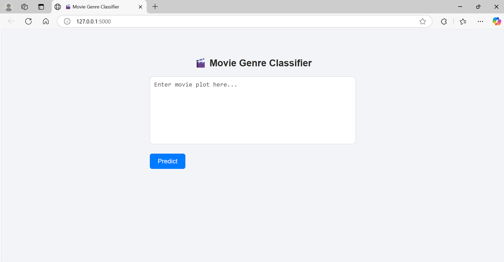
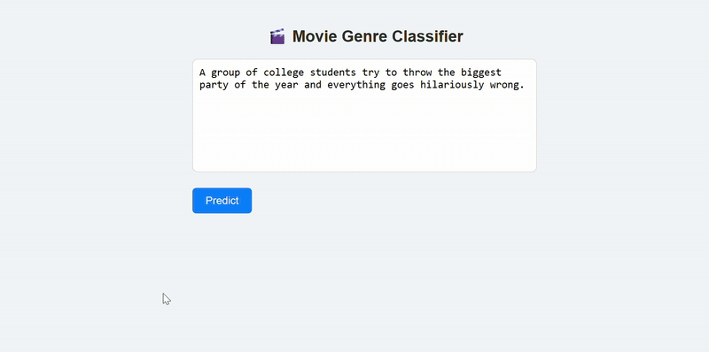

# Movie Genre Classifier

## Problem Statement

This project aims to classify movie plots into appropriate genres based on their textual descriptions. Movie genres are often overlapping and ambiguous, making this a challenging natural language processing (NLP) task. The classifier predicts the most likely genre a movie belongs to using traditional NLP techniques.

## Tech Stack

- Python 3
- Pandas
- Scikit-learn
- Flask
- HTML/CSS (for UI)
- Joblib (for model persistence)

## Project Structure

```
movie-genre-classifier/
├── app.py                   # Flask application
├── data/
│   └── movies.csv          # TMDB dataset
├── src/
│   ├── preprocess.py       # Data cleaning and preparation
│   ├── train.py            # TF-IDF + Logistic Regression training
│   └── predict.py          # Model prediction logic
├── templates/
│   └── index.html          # Web UI
├── genre_classifier.pkl    # Trained model
├── requirements.txt        # Python dependencies
└── README.md               # Project documentation
```

## Setup Instructions

1. Clone the repository:

```bash
git clone https://github.com/avinash-betha/movie-genre-classifier.git
cd movie-genre-classifier
```

2. Create and activate a virtual environment:

```bash
python -m venv venv
source venv/bin/activate  # On Windows: venv\Scripts\activate
```

3. Install dependencies:

```bash
pip install -r requirements.txt
```

4. Train the model:

```bash
python src/train.py
```

5. Run the Flask app:

```bash
python app.py
```

6. Open your browser and go to:

```
http://127.0.0.1:5000/
```

## Sample Plots to Test

- "A haunted house terrifies a family with ghost sightings and possession."
- "A group of students throw a party that spirals out of control."
- "A young girl must save her kingdom from a dark magical force."
- "A detective investigates a murder in a small, quiet town."
- "Two people fall in love during a vacation in Italy."

## Screenshot of the UI



## UI Demo



## Possible Improvements

- Upgrade to multi-label classification to handle movies with multiple genres
- Integrate contextual embeddings (e.g., BERT, DistilBERT) for higher accuracy
- Add unit tests and error handling
- Deploy the app to a cloud service (e.g., Render, Hugging Face Spaces)
- Store prediction history in a database for analytics
- Show top 3 predicted genres with confidence scores
